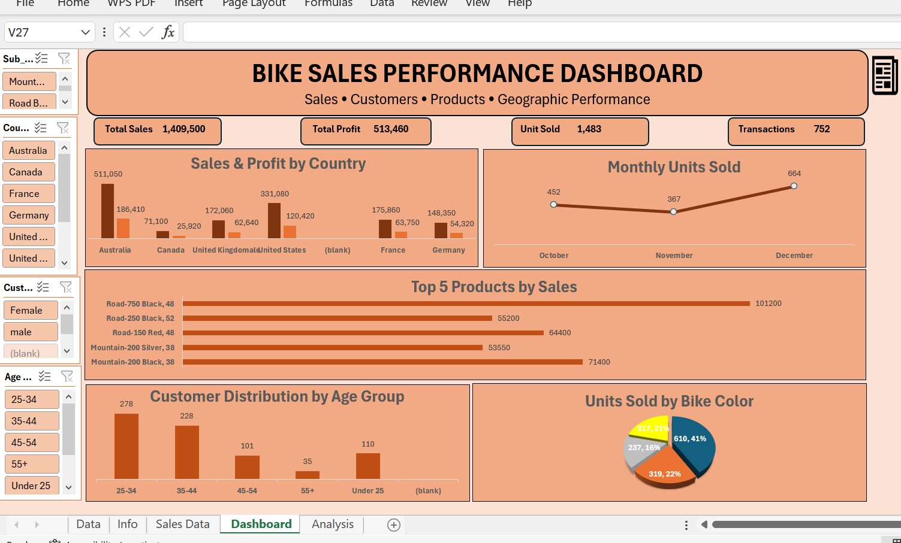

# 🚴 Bike Sales & Customer Analysis Dashboard

## 📊 Project Overview

This project analyzes bike sales and customer purchasing behavior using Microsoft Excel.

The analysis was designed to go beyond basic calculations by transforming business questions into Pivot Table analyses and presenting the main findings through an interactive Excel Dashboard.

The project focuses on:

- Sales and profit performance
- Customer purchasing behavior
- Product and bike category performance
- Customer age groups
- Gender-based purchasing behavior
- Geographic performance
- Monthly demand
- Bike color preferences
- Unit price and demand relationships
- State-level transaction performance

---
## 📊 Dashboard Preview

---

## 🎯 Project Objectives

The main objective of this project is to demonstrate a data-analysis workflow:

**Understanding the data → Asking analytical questions → Analyzing the data → Finding insights → Communicating the results**

The project contains 10 analytical questions, with each question answered using an appropriate Pivot Table.

---

## 🛠️ Tools & Technologies

- Microsoft Excel
- Pivot Tables
- Pivot Charts
- Slicers
- Excel Dashboard
- Data Analysis
- Data Visualization

---

## 📁 Project Structure

| File | Description |
|---|---|
| `Bike_Sales_Analysis.xlsx` | Complete Excel analysis including the dataset, Pivot Tables, analysis, and interactive Dashboard |
| `Bike_Sales_Analytical_Report_Final.docx` | Analytical report containing the 10 questions and their findings |
| `Dashboard.png` | Preview of the final Excel Dashboard |

---

## 🔎 Analytical Questions

The project answers the following 10 questions:

1. Which countries generate the highest sales and profit?
2. Which bike sub-category is more popular based on the number of orders and quantity sold?
3. Which age group places the highest number of orders?
4. How does purchasing behavior differ between male and female customers in terms of order quantity?
5. Which country has the highest average order quantity per transaction?
6. Which bike colors are most preferred based on the number of units sold?
7. How does the number of units sold change from October to December?
8. Which day of the week has the highest number of sales transactions?
9. How does demand vary across different unit price levels?
10. Which states have the highest number of sales transactions within each country?

---

## 📈 Key Findings

### 🌍 Geographic Performance

Australia generated the highest sales and profit:

- **Sales:** 511,050
- **Profit:** 186,410

The total sales across the analyzed data were:

- **Total Sales:** 1,409,500
- **Total Profit:** 513,460

---

### 🚲 Product Category Performance

Road Bikes were the most popular category:

- **Units Sold:** 1,018
- **Transactions:** 520

Mountain Bikes recorded:

- **Units Sold:** 465
- **Transactions:** 232

---

### 👥 Customer Analysis

The **25–34** age group recorded the highest number of transactions:

- **278 transactions**

Female customers recorded slightly more transactions and units sold than male customers, while their average order quantities were very similar.

---

### 🎨 Bike Color Preference

Black was the most preferred bike color based on units sold:

- **Black:** 610 units
- **Red:** 319 units
- **Yellow:** 317 units
- **Silver:** 237 units

---

### 📅 Monthly Demand

Demand increased significantly in December:

| Month | Units Sold |
|---|---:|
| October | 452 |
| November | 367 |
| December | 664 |

December recorded the highest demand, while November recorded the lowest.

---

### 📆 Day-of-Week Transactions

Wednesday recorded the highest number of sales transactions:

- **114 transactions**

---

### 💰 Price & Demand

The price level of **850** recorded the highest demand:

- **342 units sold**

---

## 📊 Dashboard

The Excel Dashboard provides a visual summary of the main business indicators and analysis.

It includes:

- Total Sales
- Total Profit
- Units Sold
- Transactions
- Sales & Profit by Country
- Monthly Units Sold
- Top 5 Products by Sales
- Customer Distribution by Age Group
- Units Sold by Bike Color

The dashboard also includes interactive filters using Excel Slicers.

---

## 🔗 Interactive Navigation

The Excel workbook includes navigation elements that make it easier to move between different parts of the analysis.

Users can navigate between:

**Pivot Tables → Dashboard → Analytical Report**

This provides a more organized and user-friendly analysis experience.

---

## 💡 Skills Demonstrated

Through this project, I demonstrated my ability to:

- Understand and explore a dataset
- Formulate analytical business questions
- Build and organize Pivot Tables
- Select suitable analytical methods for different questions
- Analyze customer and sales behavior
- Compare performance across countries
- Identify trends and patterns
- Create interactive dashboards
- Present analytical findings clearly
- Transform raw data into meaningful business insights

---

## 📌 Project Outcome

This project demonstrates how Excel can be used as an end-to-end data analysis and visualization tool, starting from raw sales data and ending with analytical insights, Pivot Tables, an interactive Dashboard, and a structured analytical report.
